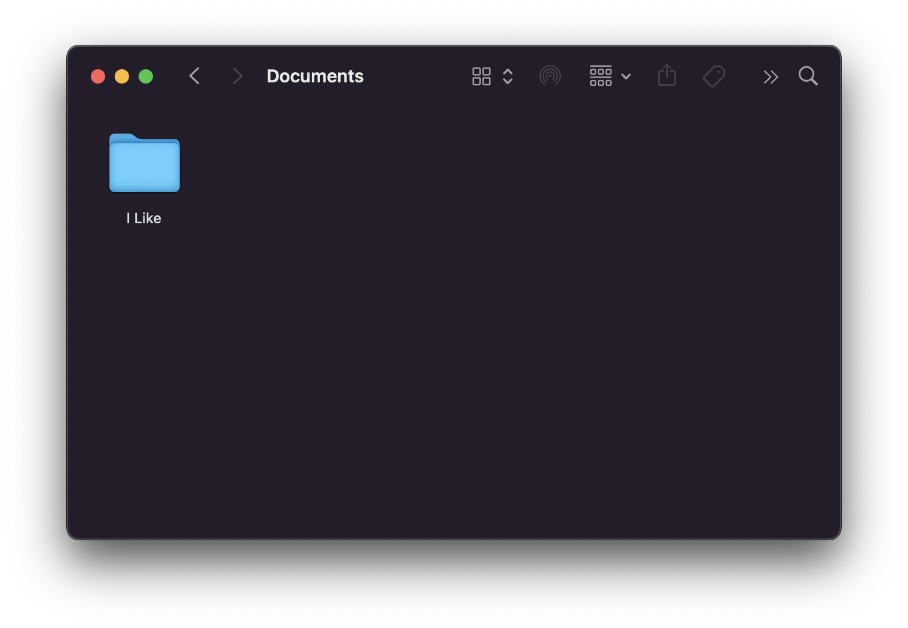
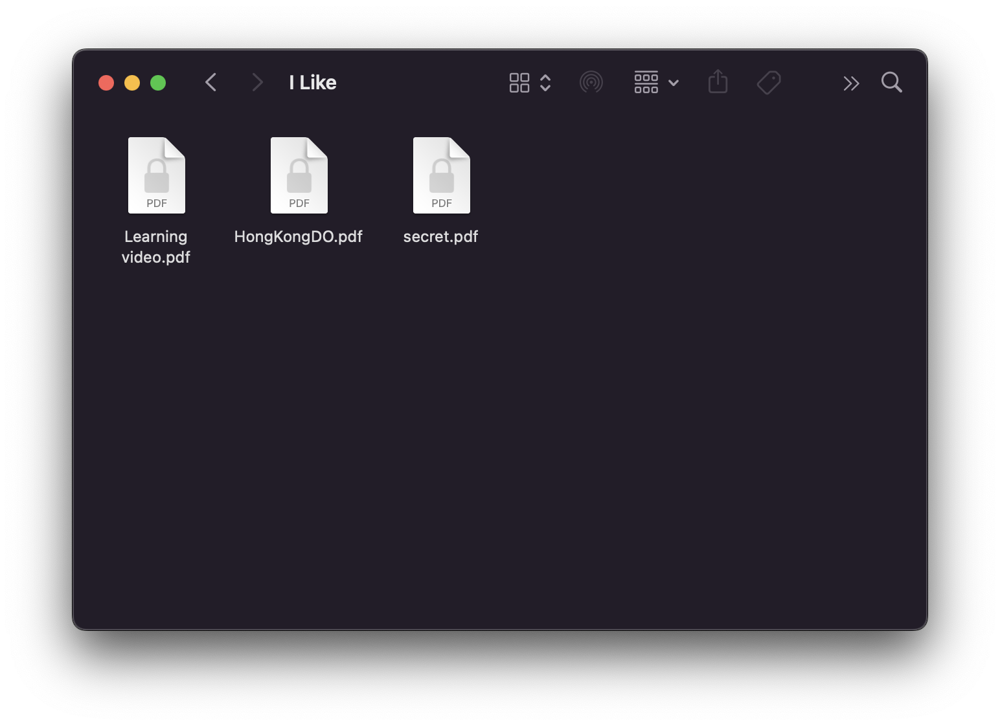
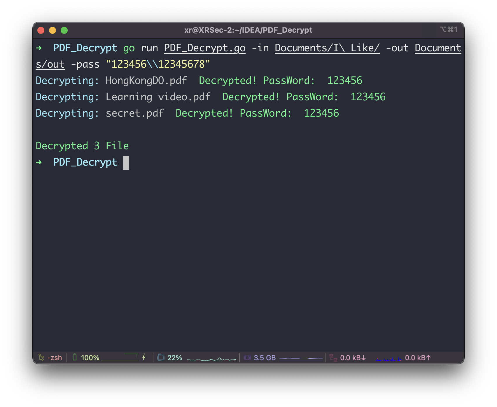
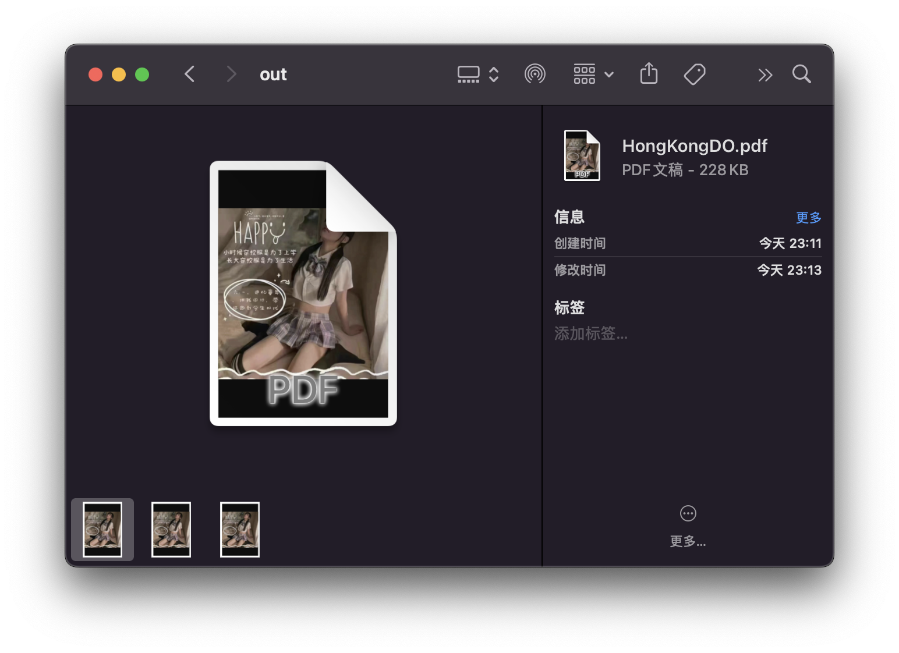

## Batch unlock PDF password

**One day, I discovered the secret of my good friend 😅**



**let's see what's there 😍**



**It looks great, but it's encrypted, what to do?**





**Happy Children's Day**

[](https://pdfcpu.io/)

## Use

```bash
PDF_Decrypt -in Documents/I\ Like/ \
-out Documents/out \
-pass "123456\\12345678"
```

```bash
PDF_Decrypt -in /User/tom/Documents/PDFS \
-out /User/tom/Documents/PDFOUT \
-pass "123456\\12345678\\abcdefg"
```

